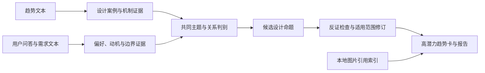

# 通用设计高潜力趋势归纳方案

> 2026-09-08 最新实现：默认Skill已改为3.0轻量设计启发流程，以明显重合为准，仅保留代码整理、少量方向笔记和一次成稿；不再执行下文原方案中的八阶段严格审核/反证。下文作为历史方案保留，新任务以 ref/design-trend-synthesizer/SKILL.md 为准。验证仅用微型代表样本。

日期：2026-09-07。状态：方案已按后续要求落地为独立可复用 Skill，入口见 [design-trend-synthesizer](../ref/design-trend-synthesizer/SKILL.md)。本文件保留方法论与原设计论证，当前执行协议以 Skill 为准；尚未开展全量正式趋势分析。

用户已明确：不限定品类，先形成通用设计趋势；分析输入仅使用文本，输出需关联已有图片的本地路径。

**建议目标：从趋势案例与用户表达中，提炼具有双侧证据、清晰适用条件和设计转化价值的通用设计命题。** 每个命题既说明出现了什么设计变化，也说明它回应了谁的什么需求、如何形成更深层的设计原则，以及在哪些情境下不成立。“高潜力”表示值得优先开展设计验证，不等于已经证明市场增长或商业成功。

1. **本次数据基础及其影响**

| 输入 | 已核对的数据 | 对方案的影响 |
| --- | --- | --- |
| `data/trend_data/trends.json` | 500 条趋势，481 条有日期，19 条日期为空；日期范围 2013-08-05 至 2026-08-31 | 必须区分近期信号、历史案例与日期未知，不能全部当作新趋势 |
| 趋势品类 | 建筑 162、科技 104、消费文化 75、家居 59、时尚 36、室内 36、运动户外 14、消费电子 10、艺术展览 4 | 允许跨品类提取设计机制；不按原始文章数量直接决定哪个方向最重要 |
| `data/userreseach_data/users.json` | 70 名有效用户、3,511 条问答、621 条已关联需求；另有 44 条无用户归属需求 | 画像保留完整，统计支持人数时只使用可确认归属的文本 |
| 文本覆盖 | 39 人有已关联问答或需求，37 人有需求；印度 15 人、巴基斯坦 12 人、印度尼西亚 12 人 | 不能将 70 人都当作回答过设计问题，也不能把本样本推断成普遍市场偏好 |
| 画像与文本缺口 | 马来西亚 30 名用户当前没有已关联问答或需求 | 图片投票或画像不能替代缺失的偏好原因；44 条孤立需求不能靠语言猜归属 |
| 用户文本语境 | 手机研究为主，也包含服装、车辆、手表、室内、生活方式与跨品类迁移问题 | 结论可以抽象为通用设计机制，但实际用户证据的原品类和场景必须保留 |
| 已有图片索引 | 趋势侧 4,081 个引用、4,080 个已下载；用户侧 1,480 张关联图片 | 仅用于输出关联，不读取像素，也不向模型传图片 |

现有清理规则继续生效：`ai_analysis` 包含“未提及”的 43 条问答已经排除；不从源快照重新混入。问答的 `question_type` 有 2,660 条标为“色彩”，但抽样内容同时涉及整体风格、材质和生活场景，分类标签只作辅助，实际语义以问题和回答共同判断。

`ai_analysis` 是既有分析字段，`local_vl_info` 是既有视觉信息文本。两者可以引用，但要标明来源性质；不能包装成本轮直接观察或已经核对过录音的“用户原话”。当前数据没有完整的原始访谈、刺激图展示记录及用户调研日期，不能虚构这些信息。

2. **最终交付应该是什么**

建议交付一份总报告和一组可单独阅读的趋势卡。报告重点不是重复文章摘要，而是完成四层归纳：

| 层次 | 要回答的问题 | 示例表达，仅示范表达方式 |
| --- | --- | --- |
| 现象 | 趋势与用户文本分别出现了什么？ | 趋势案例减少装饰，用户谈及哑光、纯色与边缘细节 |
| 共同诉求 | 表面相似背后希望获得什么体验？ | 希望产品克制，但仍可感知品质与个性 |
| 设计原则 | 可跨品类迁移的设计机制是什么？ | 将表达重心转向材质对比、比例与有限细节 |
| 设计机会 | 可以怎样探索，哪里需要克制？ | 在不同品类试验不同触感和细节密度，保留拒绝极简的用户分支 |

每张趋势卡包含：趋势名称、一句话命题、核心用户矛盾、两侧证据如何相遇、通用设计原则、适用人群与场景、原始证据品类、可迁移品类、设计探索方向、反例与限制、近期依据、优先级及理由、待验证问题、关联图片路径。

建议主报告控制在约 6–10 个有明显差异的方向，另设探索观察清单。数量是阅读目标，不是必须填满的任务；证据不足时宁可少输出。每个方向可有 2–4 个子机会，需有不同的设计动作或适用情境，避免同一结论换几个名字。

3. **分析框架：双侧独立归纳，再求交集**

先让两侧各自形成证据，防止先看到流行风格后，把用户回答解释成支持该风格。之后用相同维度连接两侧。建议初始维度包括色彩与对比、材料与表面、形态与比例、结构与装饰、光与透明度、触觉与握持、交互与信息表达、身份与情绪、耐久与维护、环境与资源关系。允许从材料中增加新主题，不要求每条记录填满所有维度。

设计维度只是组织工具。已有设计 DNA 字段字典可以在后续提供术语映射，但本流程不调用单图 DNA 提取 Skill，不生成“已视觉确认”的风格或材质结论。技术新闻只有在文本明确涉及设计表现、体验或约束时才进入候选，例如材料耐久怎样改变表面选择；纯算力、融资或机构新闻可以不进入设计归纳，并记录理由。

方法上参考观察、主题归组、洞察与行动的逐层推进，避免把观察和解释混在同一句话中。[GOV.UK 用户研究分析方法](https://www.gov.uk/service-manual/user-research/analyse-a-research-session)强调将观察整理成主题，再形成发现与行动；本方案将其转化为可追溯的数据处理步骤。整体采用发散发现、收敛定义、再探索与验证的节奏，参考 [Design Council 的 Double Diamond](https://www.designcouncil.org.uk/resources/framework-for-innovation/)。这些是方法依据，不是对本项目候选趋势有效性的证明。

4. **第一阶段：生成仅含文本的分析包**

程序读取两份 JSON，计算文件哈希、记录数、字段覆盖、日期分布、重复候选和关联缺口。原输入保持不变，输出保存在独立运行目录。

趋势分析包使用 `id`、`title_zh`、`summary_zh`、`primary_category`、`subcategory`、`tags`、`release_time`。`local_vl_info` 作为可选辅助文本，单独标记为已有视觉分析；不能把它与同篇摘要算成两个独立来源。`confidence`、`clust_status` 原值仅留作来源元数据，不直接当作趋势潜力或证据可信度。图片地址、尺寸、哈希等元数据不进入语义分析上下文。

用户分析包以用户为单位，包含必要画像、问答的 `question + ai_analysis`、场景信息，以及需求的 `ai_index + scenario`。保留问题上下文，识别反问、否定、比较和条件表达。对缺少实质内容、仅为问题重复或无法理解指代的内容标记“不可判定”，不自动补充答案。一个长回答可以拆成多个观点，但必须保留它们来自同一用户、同一源记录。

画像用于已有证据的分组解释，不从年龄、性别、国家直接推测风格偏好。44 条孤立需求单独形成补充观察：可以提醒存在某种议题，不能作为唯一用户支持或进入分群统计，也不能单独使候选达到双侧准入。

`images`、`image_preferences` 和 `ref_pic_links` 由程序建立旁路索引；模型只需返回证据 ID 和确有文本依据的图片编码关联。图片二进制、Base64、图片工具调用、图片 URL 自动抓取均不进入模型流程。

5. **第二阶段：生成可追溯的最小证据单元**

一条证据只描述一个可核对的主张，同时保存事实内容和必要上下文。

| 字段 | 含义 |
| --- | --- |
| `evidence_id` | 本次证据的稳定标识 |
| `source_type` | 趋势摘要、用户分析、用户需求、既有视觉文本、外部资料等 |
| `input_file` / `input_sha256` | 精确定位输入版本 |
| `record_id` / `user_id` / `json_pointer` | 定位趋势或用户子记录及具体字段；指针与输入哈希共同使用 |
| `source_excerpt` | 源字段中真实存在的短片段，程序校验；引用时说明是源字段片段 |
| `claim` / `design_dimension` | 对片段的结构化解释及相关设计维度 |
| `stance` | 支持、反对、有条件、混合、不明确；趋势案例使用实践描述，不能伪装用户支持 |
| `category` / `part` / `scenario` | 原品类、部位与使用语境，没有明确依据时为空 |
| `user_value` / `constraint` | 已表达的动机及约束；推导值需显式标记为解释 |
| `derivation_group` | 同一用户访谈衍生的问答和需求、同一趋势项目的重复报道分组 |
| `related_image_refs` | 精确到观点的候选图片编码或既有关系，不由模型编造路径 |

同一回答的“喜欢哑光”和“不喜欢镭射”需要拆为两个态度。引用不能只截“喜欢”而舍弃后面的“不适合手机”。同一用户的问答与需求可能是同一访谈的不同整理结果，保留两条来源，但在人数统计中只算一个人。

按主题聚合前，应为每条输入记录记录处理状态：已提取证据、不涉及设计、上下文不足、失败待重试。这样可以核对全量覆盖，避免分批总结时悄悄漏掉低频或反对意见。

6. **第三阶段：建立主题，再判定两侧关系**

先分别聚合趋势机制和用户需求，再建立“设计表现—体验价值—适用情境”的联系。不要对 500 条趋势与 3,511 条问答逐对发起模型调用。

建议使用主题表和证据关系表完成首版：先按可重叠主题归组，再对候选主题组合做语义判断；同时从趋势找用户、从用户找趋势，保留未匹配主题。候选形成后重新读取所引用的完整源记录，检查细节是否在压缩过程中被改变。

| 关系 | 判定方式 | 输出处理 |
| --- | --- | --- |
| 直接支持 | 同一设计机制在对应情境中有趋势实践和明确用户接受 | 可进入重点候选 |
| 有条件支持 | 用户只接受某个部位、场景、强度或组合方式 | 把条件写入命题本身 |
| 跨品类机制类比 | 原品类不同，但体验诉求或设计作用具有合理联系 | 保留为可迁移假设，不能宣称目标品类已被用户验证 |
| 明确冲突 | 有相反态度、场景限制或设计实现与需求矛盾 | 保留反证，拆分人群或改写命题 |
| 证据不足 | 仅有共同关键词、图片喜欢但无理由、指代不明 | 不计为有效交集 |
| 单侧信号 | 只有趋势或只有用户需求 | 进入观察池与后续研究问题 |

真实反例：用户 45 的需求 248 表达了喜欢汽车 LED、拒绝手机 LED；用户 46 的需求 232 接受透明手表、拒绝透明手机。它们可以帮助归纳“可见技术的接受度取决于品类和使用情境”，不能支持“消费者普遍喜欢透明发光产品”。

这类任务需要覆盖整个资料库的主题。[Microsoft Research 的 GraphRAG 研究](https://arxiv.org/abs/2404.16130)讨论了全局主题归纳与普通局部检索的区别。本项目可以借鉴分层归纳与回查原始证据的思路，首版先用 JSON、主题索引和受控模型调用实现；引入完整图数据库或向量服务暂时没有必要。是否增加向量检索，应由全量运行的漏召回与成本结果决定。

7. **第四阶段：深层提炼与高潜力判断**

每个候选应依次回答六个问题：用户想获得什么、现有方案存在什么矛盾、趋势侧提供了什么新的表达方式、二者共同支持什么通用原则、能转化成哪些不同品类的设计动作、哪些条件会让它失效。

建议先通过准入条件，再分别评估潜力与证据，不让模型直接报一个精确总分。

**准入条件：** 至少包含一条有效趋势证据和一条可归属用户的有效文本证据；设计机制明确；引用能够定位；完成正反证搜索；跨品类推演已标出假设身份。只有单个用户或单个项目的方向仍可保留，但进入探索级，不能写成广泛共识。

**潜力维度：**

| 维度 | 关注内容 | 不能替代它的指标 |
| --- | --- | --- |
| 需求意义 | 是否涉及明确、持续或有代价的体验问题与情绪诉求 | 同一人重复说了多少次 |
| 设计表达价值 | 是否能够转成明确的颜色、材质、形态、比例、光、结构或交互原则 | 只有“高级”“年轻”“科技”等抽象词 |
| 跨品类启发 | 是否能解释不同品类中的共同机制，并说明迁移条件 | 列出很多未经论证的应用品类 |
| 当前相关性 | 是否有近期案例支持该方向仍值得探索 | 旧案例摘要中的“未来”“创新”宣传词 |
| 可验证性 | 能否提出清楚的原型变化、比较方案及验证问题 | 未有依据的制造成本或商业收益估计 |

**证据维度：** 独立用户数、支持/反对/混合态度分布、独立项目数、来源品类范围、文本直接程度、来源日期、缺失信息及反证覆盖。分别输出“较充分/有限/不足”和原因；这里的充分仅指本资料集内部，不代表市场代表性。

主报告可分为“优先验证”“细分情境机会”“探索观察”。第一版可将“至少 3 名独立用户、至少 2 个去重项目、有近期依据、无未解决的核心推理跳跃”作为进入优先验证池的初始审查条件；这只是待校准的工作规则，不是统计显著性或科学标准。单品类用户证据即使达到数量门槛，也不能升级为“跨品类已验证”。若后续确需综合分数，再经人工确认权重，并显示分项与依据；成本、量产可行性等无数据项保持未知。

**计数与时效规则：**

- 用户数由程序按唯一用户 ID 计算。同一用户、同一主题、同一情境重复表达不增加支持人数；正负并存保留混合态度，跨情境则分别记录。
- 展示支持、反对、条件支持或混合人数，以及证据涉及人数。没有完整的问卷触达/图片展示记录时，不计算“所有用户喜欢率”；无回答不等于反对。源图反馈的行数不能直接当作独立用户数。
- 同一品牌项目或活动的重复趋势先归为一个项目，保留原条目 ID。当前趋势包缺少原文章页 URL，发布者独立性无法完全验证；不同 ID 不直接等于独立来源。
- 日期以运行日为基准，建议初始分为近 24 个月、25–60 个月、超过 60 个月、日期未知，均保留原日期。这些窗口可调整，历史案例用于机制启发，未知日期不填估计值。
- 500 条资料是一个已选取的样本库，不能根据年度条目多少声称市场增速、热度上升或将来爆发。若报告需要这种判断，应另建有采集口径和时间分母的外部证据。

8. **第五阶段：反证审核与报告生成**

候选生成之后安排独立的审核步骤，输入候选和相关完整证据，专门寻找支持不足、遗漏反例、品类跳跃、来源重复、把推断写成事实和过度抽象的问题。审核角色可通过同一模型的独立调用实现，不必一开始使用多个模型。

审核结果分为保留、缩小范围、拆成子方向、降入观察池和拒绝。只允许用现有证据修订命题；无依据时不能让模型凭常识补造支持。对不同候选再次检查重复：如果用户矛盾、设计机制与行动建议都相同，就应合并。

最终报告由已审核的结构化趋势卡生成。明确分开“资料支持的发现”“分析解释”“创意设计建议”“后续验证问题”，读者可以知道每句话属于哪一层。每个核心发现附证据编号；创意建议列出依据和仍需验证的假设。

9. **图片路径怎样关联，才能符合纯文本输入**

图片关联由程序在语义分析后完成，模型只返回有效来源 ID、证据 ID，以及文本明确提到的图片编码关系。

| 来源 | 回填方式 | 必须保留的限制 |
| --- | --- | --- |
| 趋势案例图 | `trend_id → trends[].images[]` | 默认是文章级关联；未经看图不能声称某一张准确展示了具体材质或特征 |
| 用户需求图 | 对应需求的 `ref_pic_links`，并核对具体观点涉及哪个编码 | 一条需求有多张图时，不把全部图片挂到拆出的每一个观点上 |
| 用户问答图 | 回答明确提及编码时，仅在同一用户的 `image_preferences` 中匹配；结合上下文核对 | 编码不明确、多个候选或关系缺失时保留未匹配；不能跨用户猜配 |
| 反例图 | 使用明确反对观点对应的已有图片关系 | 标记反例，不能放入正向建议图库 |

`ENJOY` / `DISLIKE` 只证明相应反馈，不能仅凭喜欢某图推导其喜欢该图的颜色、材质或风格。趋势图片的现有选择顺序不代表视觉代表性；首版可提供全部关联路径，报告仅显示少量标为“来源关联图”的路径，代表图由人工后续选定。

每条图片引用建议包含 `image_id`、`path`、`source_type`、`source_record_id`、`evidence_ids`、`role`、`association_level`、`match_status`、`file_exists`、`visual_verified=false`。`association_level` 区分文章级、记录级和观点级；没有观点级对应时不提升关系精度。

持久化路径统一采用相对项目根目录的形式，例如 `data/trend_data/images/9025/001_ffac001eb672122f50d7.png`；本机报告将其解析为可点击的绝对路径。趋势和用户目录的原始 `local_path` 各自相对于不同输出目录，必须通过来源根目录拼接，不能直接混用。

现有失败图片保留 `path=null` 和失败状态；不因为附图缺失否定本已成立的文本证据。程序可以检查路径存在性，不需要打开图片或进行视觉分析。

10. **外网搜索的角色**

建议第一轮先形成不依赖外网的候选，随后对进入优先验证池的方向补充近期依据并主动检索反例。这样可以清楚区分本地交集与外部扩展。

检索重点为设计师或品牌项目原页、材料与工艺厂商技术资料、正式设计研究与有调查口径的用户研究。每个候选先寻找少量直接相关的资料，而不是堆砌链接。保存页面标题、URL、发布日期、访问时间、项目发生时间、支持或反驳的具体主张及短摘录；区分原始资料和转载。

网络证据可以确认案例是否近期、帮助理解跨品类迁移条件、提示工艺限制，也可以推翻过时描述。它不能代替缺失的本地用户需求，不能把宣传文案当用户共识。检索词使用通用设计议题与产品名，不发送用户 ID、画像明细或私有访谈片段。没有找到外证时，保留来源缺口，不编造链接。

11. **用现有内容说明输出深度**

以下是抽样得到的探索命题，用于演示方案，尚未做全量计数、独立项目核查或优先级判断。

| 探索命题 | 趋势侧依据 | 用户侧依据 | 深层提炼与边界 |
| --- | --- | --- | --- |
| 减少视觉噪声，以材质与比例建立层次 | 趋势 9025：Bottega Veneta 通过纹理、触感和比例更新极简表达，日期 2026-03-01 | 用户 46 / 问答 1197 涉及纯色背部、哑光与边缘光泽；用户 45 / 需求 238 喜欢哑光、拒绝镭射 | 可研究“克制表达如何保持辨识度”；用户 50 / 问答 1120 表达“不太会接受极简的手机设计”，不能推广为所有人的偏好 |
| 柔和配色作为放松和自我表达的线索 | 趋势 8896：Onitsuka Tiger 以柔和粉、蓝色柔化西装，日期 2026-03-01 | 用户 74 / 问答 3419 将柔和纯色与放松相连；用户 75 / 需求 750 希望手机配色呼应手链收藏 | 可研究降低视觉刺激与建立个人物品间风格联系；不从性别或国籍推导必然偏好 |
| 可见技术的表达强度需要匹配使用情境 | 趋势 12748 的半透明材料与光、12663 的环境响应灯具，分别为 2013 和 2017 年历史案例 | 用户 82 的相关需求接受透明内部和 RGB 表达；用户 45 / 46 / 80 的需求 248 / 232 / 602 给出拒绝或脆弱感反例 | 可研究哪些场景需要展示内部、哪些需要完整和稳固感；当前只能作为探索命题，历史案例不足以证明近期高潜力 |

第一条的现有关联图片：[/Users/zxy/dev/work/design_ai/data/trend_data/images/9025/001_ffac001eb672122f50d7.png](/Users/zxy/dev/work/design_ai/data/trend_data/images/9025/001_ffac001eb672122f50d7.png)。这是来源文章的关联图，当前未做图片内容核验。

第二条的现有关联图片：[/Users/zxy/dev/work/design_ai/data/trend_data/images/8896/001_0176f0c71fdfd247150b.png](/Users/zxy/dev/work/design_ai/data/trend_data/images/8896/001_0176f0c71fdfd247150b.png)。用户 75 的需求 750 中 `P253` 当前未匹配，报告应如实保留缺口，不从其他用户中补图。

精确引用示例：用户 46 / 问答 1197 的 `ai_analysis` 位于当前用户文件的 `/users/1/aesthetic_research/0/ai_analysis`；用户 45 / 需求 248 的反例位于 `/users/0/demand_research/0/ai_index`。正式执行时由程序生成指针并绑定文件哈希，不将这些下标硬编码到流程。

12. **工程落地与运行成本控制**

建议先实现可复现的后端离线流程，再接平台页面。复用现有 Python、DeepAgents、Pydantic、模型目录、调用与追踪能力；模型从项目已有目录选择，不在新模块重复配置供应商或凭据。当前只完成方案，不启动正式模型分析。

首版建议按现有项目结构增加以下职责，具体文件拆分随实现规模保持简单：

| 位置 | 职责 |
| --- | --- |
| `backend/scripts/prepare_design_trend_insights.py` | 运行入口、只读预览、小样本试跑、全量运行与续跑 |
| `backend/app/services/trend_insights.py` | 文本投影、证据索引、统计、校验、阶段调度与输出 |
| `backend/app/agents/design_trend_synthesizer.py` | DeepAgents 的证据提取、候选归纳和审核调用；通过现有模型服务访问模型 |
| `backend/app/schemas/trend_insights.py` | 证据、关系、趋势卡及运行元数据的契约 |
| `backend/tests/test_trend_insights.py` | 引用、统计、跨品类反例、图片关联与恢复流程验证 |

模型输入采用分阶段、按上下文预算分批的方式。趋势按小批处理，用户先按人处理；单用户内容过长时按完整问答或场景分段，再汇总该用户主题，避免拆断问答。不能只把最终摘要送入下一轮，候选审查应能回查完整原记录。

缓存以输入内容、分析规则、Prompt、Schema、模型和参数版本联合标识；一个阶段失败只重跑该阶段，保留诊断。新记录到来时复用不变的局部证据，但全局主题、冲突、排序必须重新检查。阶段文件写入后再更新运行清单，全部校验完成才把本轮标为完成，避免半成品被当作最终结论。

成本和时长不先给未经实测的数字。试跑记录实际模型调用数、输入/输出 token、失败重试和耗时，再估计全量预算；若配置了价格信息，需要同时记录价格来源与日期。首版先使用一个可配置模型完成流程，再根据试跑质量考虑提取与复核分模型。

默认输出目录：`data/result/high_trend/<run_id>/`，由 Skill 代码自动创建独立运行目录并保存结果；正式 `prepare` 返回实际 `run_dir` 供后续续跑。

| 输出 | 作用 |
| --- | --- |
| `run_manifest.json` | 输入哈希、分析范围、日期窗口、模型/Prompt/Schema/规则版本、阶段状态、执行时间、人工审核状态 |
| `evidence.jsonl` | 可回查的最小证据，含处理来源和立场 |
| `themes.json` / `relations.jsonl` | 双侧主题与支持、类比、条件、冲突关系 |
| `high_potential_trends.json` | 正式结构化趋势卡，含统计、范围、建议和图片引用 |
| `high_potential_trends.jsonl` | 每行一个趋势卡，供后续 LLM 或接口使用 |
| `report.md` | 人可阅读的总报告与证据链接 |
| `validation_report.json` | 覆盖、引用、计数、图片路径及语义抽查结果 |
| `external_sources.jsonl` | 启用网络补充时才输出，区分本地和外部证据 |

趋势卡的公共契约建议至少包含 `id`、`title`、`thesis`、`user_tension`、`design_principle`、`evidence_scope`、`transfer_hypotheses`、`opportunities`、`boundaries`、`supporting_evidence_ids`、`counter_evidence_ids`、`support_statistics`、`recency`、`priority`、`evidence_strength`、`validation_questions`、`image_refs`、`review_status`。统计和路径由程序写入，模型不拥有最终数字与路径的决定权。

前端后续可以展示趋势总览、单卡详情、双侧证据及反证、关联图片路径/预览、人工保留/修改/降级。普通页面集中呈现设计命题和适用条件，技术追溯放在可展开区域。人工修订保存原生成版本、修改内容和修改时间；本方案不把评审等同于自动业务数据写入授权。

13. **实施顺序与验收**

| 阶段 | 工作内容 | 完成标准 |
| --- | --- | --- |
| A：输入和契约 | 只读预览、来源索引、文本投影、Schema 和图片旁路关联 | 500 条趋势、39 名文本用户及孤立需求范围均被正确报告，模型输入为纯文本 |
| B：小样本闭环 | 从不同品类、年份、国家、文本密度与正反态度中选约 30 条趋势、8 名用户 | 验证证据提取、关系判断、深层归纳、反证与路径回填；这只是流程试验，不输出总体结论 |
| C：全量归纳 | 全量证据提取、主题合并、双向匹配、候选审查与报告 | 记录处理覆盖完整，未处理或失败内容可见；去重计数与引用有效 |
| D：补充与评审 | 选择性外网核实、设计人员审阅、命题修订 | 明确优先验证项及适用边界，保留审阅记录 |
| E：平台接入 | 把已验证流程接入任务与报告页面 | 可查看进度、失败恢复、结果版本与人工修改 |

必要验收项：

- **来源可追溯：** 所有事实性核心主张都有有效证据 ID，源片段在对应字段中真实存在；引用存在并不自动等于推理正确，还需语义检查。
- **数字可靠：** 人数、项目数、时间分布由程序计算；不将重复问答、衍生需求和重复报道放大为独立支持。
- **交集有效：** 重点候选具有双侧有效证据；关键词重合、单侧信号和跨品类假设的状态正确。
- **反例保留：** 用真实的“汽车 LED / 手机 LED”“透明手表 / 透明手机”情境检验模型是否保存否定与条件。
- **边界清楚：** 未回答不计反对，孤立需求不计人数；用户喜欢一张图不直接归因于特定视觉属性。
- **纯文本保证：** 检查所有实际模型请求和工具权限，没有图片消息、像素读取或视觉工具调用；允许程序检查输出图片路径是否存在。
- **图片关联准确：** 所有非空路径均来自允许的源映射且可解析；明确文章级与观点级关系，多图记录不能错误扩散到全部观点。
- **语义质量：** 试跑人工审查全部候选与正反证；全量阶段审查每个优先方向，并分层抽查底层证据。发现主题合并错误或漏掉少数观点时，应修订规则并重新运行受影响阶段。
- **可恢复与可复现：** 中断后可继续，输入/规则版本可回查，草稿和已完成结果明确区分。

本方案完成后的理想产物是：设计师可以从一个通用趋势命题，直接看见它回应的具体用户诉求、能够采用的设计原则、不同品类的应用假设、必须避免的做法以及支持和反对的原始证据，再利用已关联图片进入后续设计探索。
